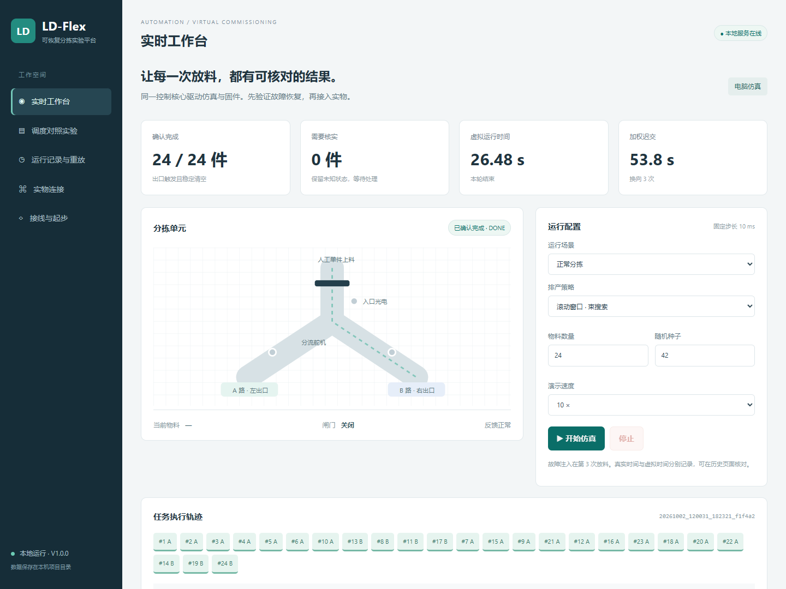

## V1.2：仿真与实测实验中心

启动服务后打开 `/lab.html`，导入已有运行、CSV日志，查看曲线与误差报告。

[使用步骤与实物接入路线](docs/仿真与实物结合升级说明.md)

# 账户维护版 V1.1.1

支持注册登录、个人数据管理和数据库持久保存。使用步骤见[开始使用多用户版](开始使用多用户版.md)及[部署说明](docs/多用户使用与部署说明.md)。原V1.0.0实验和硬件手册继续保留。当前先准备部署。

# LD-Flex · 可恢复分拣与虚拟调试

面向小批量配料分流的桌面实验平台。研究三个相互关联的问题：任务怎么排、执行是否可信、故障后怎样恢复。

**当前定位：本科自动化竞赛与实验工程。** 两路重力滑槽是低成本验证载体；研究对象是带换向代价的排产、控制状态机和异常恢复。实物采用人工单件上料，不能把任务队列直接当成已识别的物料队列。

## 直接运行

Windows：双击 `启动项目.cmd`，或在 PyCharm 中运行 `app.py`。本地页面地址以控制台输出为准。

Python 3.11+；仿真控制核心由 C 编译成共享库。首次安装见 `docs/实操手册.md`，本机交付目录已构建。首次安装运行 `python -m pip install -r requirements.txt`，账户版依赖 Django 与 Waitress；安装完成后，本机仿真不需要联网。串口依赖 pyserial 已列入 requirements.txt。

[完整实操手册](docs/实操手册.md) · [实验设计](docs/方法与实验设计.md) · [真实验收与实验结果](docs/验收与仿真结果.md)

## 工程结构

| 路径 | 内容 |
|---|---|
| `core/` | 仿真和 STM32 复用的 C 状态机、CRC 通信协议 |
| `ldcell/` | 排产、虚拟设备、实验统计、审计存储、串口会话 |
| `web/` | 本地实验工作台 |
| `firmware/` | STM32F103C8 驱动、启动文件、链接脚本 |
| `tests/`、`tools/` | 故障测试、构建、验收、阶段归档 |
| `docs/`、`hardware/` | 选题、设计、实操、实验协议、预算、接线 |
| `data/`、`evidence/` | 本机实际运行数据和验收记录，默认不进入 Git |

## 技术主线

1. 控制核心复用：同一份 C 代码在电脑共享库和 STM32 固件中执行。
2. 保守恢复：重启先锁定；重复指令不重复放料；状态不确定的物料需要人工核实。
3. 排产对照：FIFO、最早交期、单步贪心、滚动窗口束搜索，在相同任务集上比较迟交和换向。
4. 可重放记录：原始事件、参数、源码摘要、Git 版本和结果一起保存；摘要用于发现改变，不证明作者身份或历史日期。

算法采用公开的经典方法，创新候选点在低成本设备的系统整合、恢复协议和可复现实验。成果程度由后续实测决定，详见 `docs/竞赛与实验计划.md`。

## 许可证与贡献

代码采用 MIT。请保留许可证；物理装置接线和承载能力需要自行验证。欢迎用可复现的失败日志提交 issue，贡献流程见 `CONTRIBUTING.md`。

English: A low-cost recoverable sorting cell with a shared C controller for virtual commissioning and STM32 deployment. Includes scheduling baselines, fault injection and local experiment records. Physical validation is pending.
